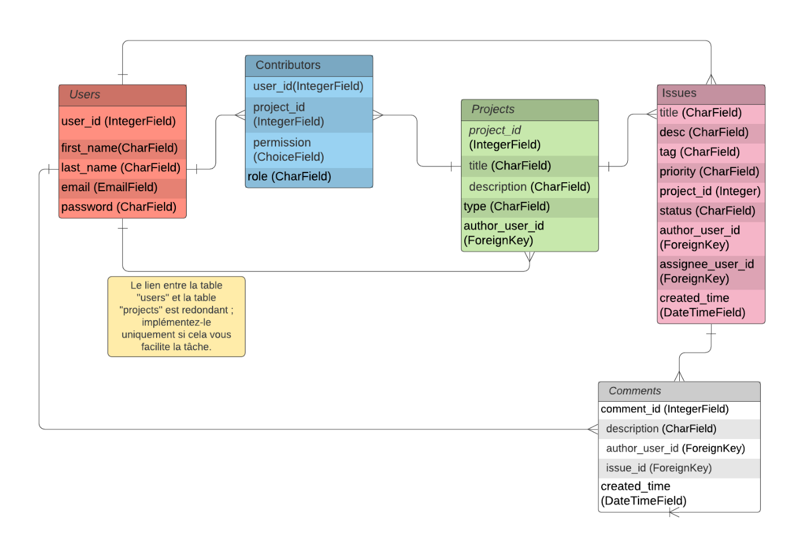

# SoftDesk
## Présentation

Cette API servira aux applications sur iOS, Android et web de suivre des projets avec la résolution de leurs problèmes.
Elle gère les projets, les problèmes d’un projet, les commentaires d’un problème et les différents contributeurs ainsi que leur permissions.

Cette API est sécurisée selon la liste des vérifications OWASP. Elle utilise des tokens grâce au module [simplejwt](https://django-rest-framework-simplejwt.readthedocs.io/en/latest/).

## Installer l'API en local

Cloner le projet:
```git clone https://github.com/LisaInc/P10-SoftDesk.git```

Créer un environnement virtuel avec venv:

```
python3 -m venv .venv
. .venv/bin/activate

```

Installer Django et ses dépendance:
```pip install -r requirements.txt```

À partir du dossier SoftDesk, pour lancer le serveur:
```python3 manage.py runserver```

L'api sera à l'adresse http://127.0.0.1:8000/, pour voir la liste des endpoints se référer à la documentation.

Ce lien renvoie sur la page de connexion du site, faire un compte pour accéder au reste du site.

## Documentation Postman
La documentation généré par postman est disponible: https://documenter.getpostman.com/view/19707856/UVsTs3b9
